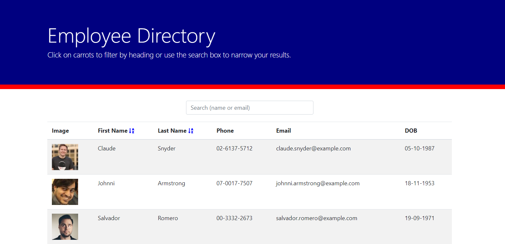

# Employee Directory

            
## Description

This React application allows users to easily access employee data.

Features: 

- Filter down employees by searching for their first name, last name or email. 
- Sort employees from A-Z by their first or last name.

## User Story 

AS A user
I WANT to be able to view my entire employee directory at once 
SO THAT I have quick access to their information.

## Table of Contents

[Installation](#installation)    
[Deployment](#deployment)                   
[License](#licenses)  
[Contributing](#contributing)                                                                                                          
[Questions](#questions) 

## Installation

1. Clone this reoo.
2. Run 'npm i' to install all dependencies.
3. Run 'npm start' and navigate to https://localhost:3000 to view the application.

## Deployment

<a href="https://prabhm512.github.io/employee-directory/">Employee Directory (click to view)</a>

## Licenses

The underlying source code used to format and display this content is licensed under the 

## Contributing
                      
Prabh Singh  

## Questions 

My Github profile is <a href="https://github.com/prabhm512">prabhm512</a>.

If you have any questions regarding this project, please email prabhm512@gmail.com.
